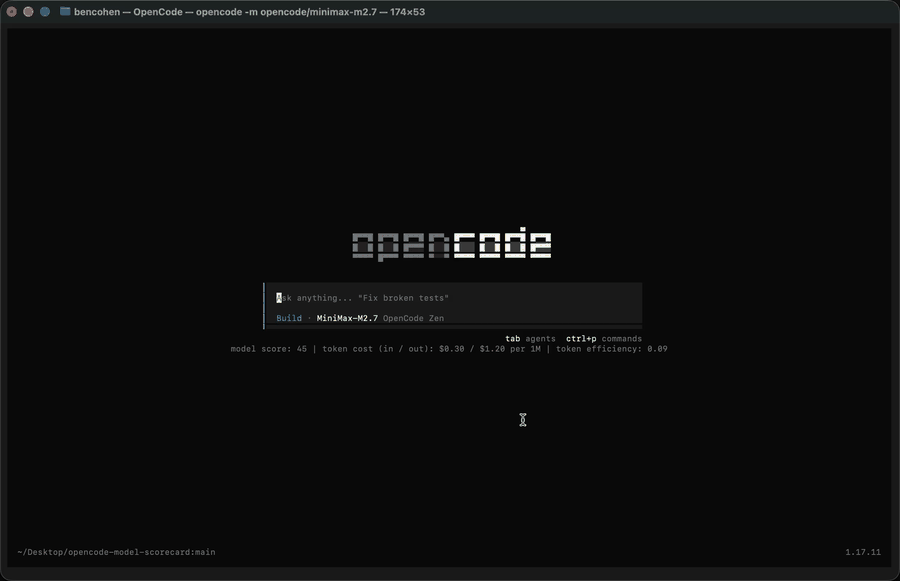

# OpenCode Model Scorecard

[](https://www.npmjs.com/package/opencode-model-scorecard)
[](https://github.com/bnc4vk/opencode-model-scorecard/actions/workflows/ci.yml)
[](LICENSE)

OpenCode TUI plugin that shows model benchmark score, token cost, and token
efficiency directly on the home screen so you can choose models with local
quality and cost context.



The status line stays visible while you work:

```text
model score: 77 | token cost (in / out): $5.00 / $25.01 per 1M | token efficiency: 0.08
```

## Install

Install globally into your OpenCode TUI config:

```sh
opencode plugin opencode-model-scorecard -g
```

OpenCode installs npm plugins automatically on startup and caches packages under
its own cache directory.

For a project-local install, add the TUI plugin to `tui.json` or
`.opencode/tui.json`:

```json
{
  "$schema": "https://opencode.ai/tui.json",
  "plugin": ["opencode-model-scorecard"]
}
```

Open OpenCode and use the `Show model benchmark details` command to inspect the
Terminal-Bench rows, token prices, and token-efficiency calculation for the
currently selected model.

## Why This Exists

Model choice in OpenCode is usually a tradeoff between coding-agent quality,
input/output price, and how many output tokens a model tends to spend to solve
tasks. Those signals are scattered across benchmark pages, provider catalogs,
and local usage. Model Scorecard puts the most useful comparison line in the
place where you pick and use models.

## Data Sources

- **Model score**: Terminal-Bench 2.1 when available, Terminal-Bench 2.0 as a
  fallback, then Artificial Analysis Terminal-Bench v2.1 when official rows are
  missing.
- **Token cost**: OpenCode Data model catalog.
- **Token efficiency**: Artificial Analysis Terminal-Bench v2.1 score and
  output-token data when available, with OpenCode session-cost rows retained as
  a real observed fallback.

All data is bundled into the package at release time and resolved locally at
runtime. The plugin does not call a backend or fetch benchmark data while you
use OpenCode.

## Known Limits

- Models without a Terminal-Bench or Artificial Analysis match show `n/a` for
  benchmark-derived fields.
- Benchmark rows are useful comparison signals, not absolute model rankings for
  every codebase.
- Prices and benchmark coverage update only when maintainers publish a refreshed
  npm release.
- Provider aliases can differ. Please open a missing-model issue when a model
  should resolve but does not.

## Score Refreshes

Maintainers can refresh the hardcoded benchmark registry before publishing a new
npm release:

```sh
npm run update:scores
npm test
npm run pack:dry-run
npm version patch
npm publish
```

The refresh command uses Terminal-Bench 2.1, Terminal-Bench 2.0, Artificial
Analysis Terminal-Bench v2.1, and OpenCode Data, then rewrites only the marked
data arrays in `.opencode/plugins/model-score-data.mjs`. End users do not need a
backend or a network call at runtime.

## Adoption

See [docs/adoption.md](docs/adoption.md) for the discovery plan, validation
checks, listing copy, and launch assets used to make this plugin easier for
OpenCode users to find and evaluate.
